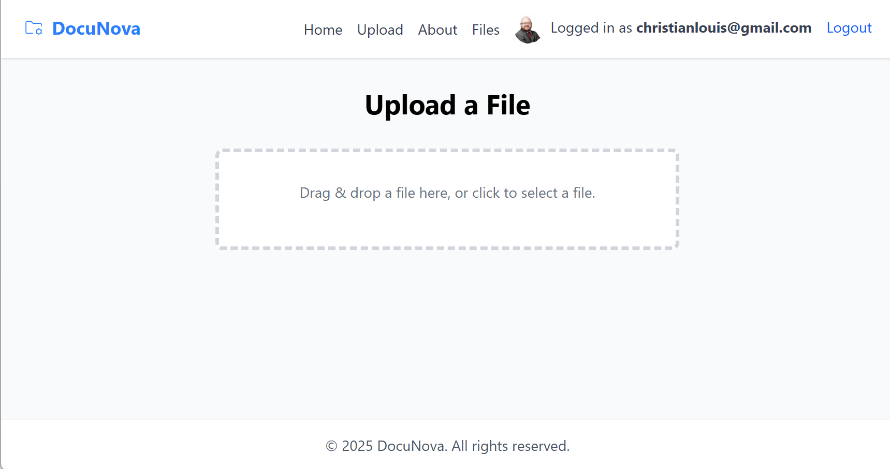
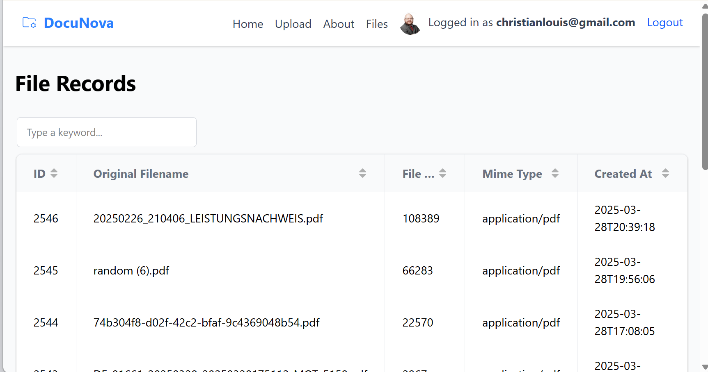
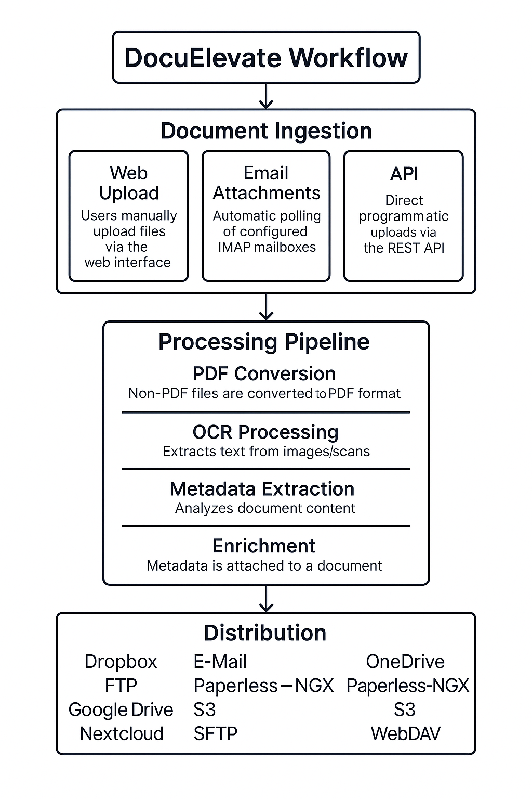

<div align="center">
  
  <p>Intelligent Document Processing & Management</p>
</div>

# DocuElevate

<div align="center">

[](https://codecov.io/github/christianlouis/DocuElevate)
[](https://github.com/christianlouis/DocuElevate/actions/workflows/tests.yaml)
[](https://github.com/christianlouis/DocuElevate/actions/workflows/docker-ci.yml)
[](https://github.com/christianlouis/DocuElevate/actions/workflows/codeql.yml)

[](https://github.com/christianlouis/DocuElevate/releases)
[](LICENSE)
[](https://www.python.org/downloads/)
[](https://hub.docker.com/)

[](https://github.com/christianlouis/DocuElevate/stargazers)
[](https://github.com/christianlouis/DocuElevate/network/members)
[](https://github.com/christianlouis/DocuElevate/issues)
[](https://github.com/christianlouis/DocuElevate/pulls)

</div>

<div align="center">
  <a href="https://www.docuelevate.org"></a>
</div>

## Overview

DocuElevate automates the handling, extraction, and processing of documents using a variety of services, including:

- **OpenAI** for metadata extraction and text refinement.  
- **Dropbox**, **Nextcloud**, and **Google Drive** for file storage and uploads.  
- **Paperless NGX** for document indexing and management.  
- **Azure Document Intelligence** for OCR on PDFs.  
- **Gotenberg** for file-to-PDF conversions.  
- **Authentik** for authentication and user management.  

It is designed for flexibility and configurability through environment variables, making it easily customizable for different workflows. The system can fetch documents from multiple IMAP mailboxes, process them (OCR, metadata extraction, PDF conversion), and store them in the desired destinations.

The project includes a **UI** for uploading and managing files, and an API documentation page is available at `/docs` (powered by **FastAPI**).

## Documentation Index

- [User Guide](docs/UserGuide.md) - How to use DocuElevate
- [API Documentation](docs/API.md) - API reference
- [Deployment Guide](docs/DeploymentGuide.md) - How to deploy DocuElevate
- [Configuration Guide](docs/ConfigurationGuide.md) - Available configuration options
- [Build Metadata](docs/BuildMetadata.md) - Automated version and build information
- [Development Guide](CONTRIBUTING.md) - How to contribute to DocuElevate
- [Troubleshooting](docs/Troubleshooting.md) - Common issues and solutions

## Screenshots

<div align="center">
  
  <p><em>Upload interface for adding new documents</em></p>
  
  
  <p><em>Files view with processed documents and metadata</em></p>
</div>

## Workflow Process

DocuElevate follows a streamlined document processing workflow:

<div align="center">
  
</div>

### Document Ingestion
Documents enter DocuElevate through three possible channels:
1. **Web Upload**: Users manually upload files via the web interface
2. **Email Attachments**: Automatic polling of configured IMAP mailboxes (supports multiple accounts)
3. **API**: Direct programmatic uploads via the REST API

### Processing Pipeline
Every document goes through the following steps:
1. **PDF Conversion**: Non-PDF files are converted to PDF format using Gotenberg
2. **OCR Processing**: Azure Document Intelligence extracts text from images/scans
3. **Metadata Extraction**: OpenAI analyzes document content to identify:
   - Document type (invoice, receipt, contract, etc.)
   - Key entities (dates, names, amounts, account numbers)
   - Important data points specific to the document type
4. **Enrichment**: Metadata is attached to the document in a structured format

### Distribution
Processed documents with their metadata can be automatically sent to:
- **Dropbox**: For cloud storage and sharing
- **Nextcloud**: For self-hosted file storage
- **Google Drive**: For Google Workspace integration
- **Paperless-NGX**: For advanced document management with search capabilities

Users can choose to send documents to any combination of these destinations through configuration settings or manual selection.

## Features

- **Intuitive File Upload**:  
  - Drag-and-drop file upload on both Upload and Files pages—upload anywhere on the Files page
  - Real-time upload progress with validation
  - Support for PDF, Office documents, images, and more (up to 500MB per file)
- **Document Upload & Storage**:  
  - Manual uploads (via API or UI) to Dropbox, Nextcloud, Google Drive, or Paperless  
- **OCR Processing (Azure)**:  
  - Extract text from scanned PDFs using Azure Document Intelligence  
- **Metadata Extraction (OpenAI)**:  
  - Use GPT to classify, label, or otherwise enrich the text with structured metadata  
- **PDF Conversion (Gotenberg)**:  
  - Convert non-PDF attachments (e.g., Word docs, images) into PDFs  
- **Document Management (Paperless NGX)**:  
  - Store processed documents and metadata in a Paperless NGX instance  
- **IMAP Integration**:  
  - Fetch documents from multiple mailboxes (including Gmail) and automatically enqueue them for processing  
- **Authentication**:  
  - Secure access to the system using **Authentik** for OAuth2-based login

## Frameworks Used

- **FastAPI**: High-performance web framework for APIs.
- **Celery**: Task queue for asynchronous processing.
- **Redis**: Message broker and result backend.
- **SQLAlchemy**: ORM for database interactions.
- **Tailwind CSS**: Utility-first CSS framework.
- **Docker**: Containerization for easy deployment.

## Quick Start

For detailed installation and deployment instructions, please refer to the [Deployment Guide](docs/DeploymentGuide.md).

```bash
# Clone the repository
git clone <repository_url>
cd document-processor

# Configure environment variables
cp .env.example .env
# Edit .env with your settings

# Run with Docker Compose
docker-compose up -d
```

The API will be available at **`http://localhost:8000`**, and the API documentation is available at **`http://localhost:8000/docs`**.

## License

This project is licensed under the Apache License 2.0 - see the [LICENSE](LICENSE) file for details.

## Third-Party Software

This project uses various third-party libraries and components. See [NOTICE](NOTICE) for attributions and the [attribution page](frontend/templates/attribution.html) in the application for more details.

### LGPL Compliance

This project uses Paramiko which is licensed under LGPL-2.1. In accordance with the LGPL license:

- The source code for Paramiko can be obtained from https://github.com/paramiko/paramiko
- A copy of the LGPL license is available in the application at `/licenses/lgpl.txt`
- Users have the right to modify and redistribute Paramiko under the terms of the LGPL

## Dependency Licenses

The following is a summary of the licenses used by our direct dependencies:

| Dependency | License |
|------------|---------|
| FastAPI    | MIT     |
| Celery     | BSD     |
| Uvicorn    | BSD     |
| SQLAlchemy | MIT     |
| Pydantic   | MIT     |
| OpenAI     | MIT     |
| PyPDF2     | BSD     |
| Requests   | Apache 2.0 |
| Dropbox    | MIT     |
| Azure AI Document Intelligence | MIT |
| Authlib    | BSD     |
| Starlette  | BSD     |
| Alembic    | MIT     |
| Google API Client | Apache 2.0 |
| Microsoft Graph Core | MIT |
| MSAL       | MIT     |
| Boto3      | Apache 2.0 |
| Paramiko   | LGPL-2.1|
| Apprise    | MIT     |
| Redis      | BSD     |
| Gotenberg  | MIT     |

For a comprehensive list of all dependencies and their licenses, run:

```
pip install pip-licenses
pip-licenses
```