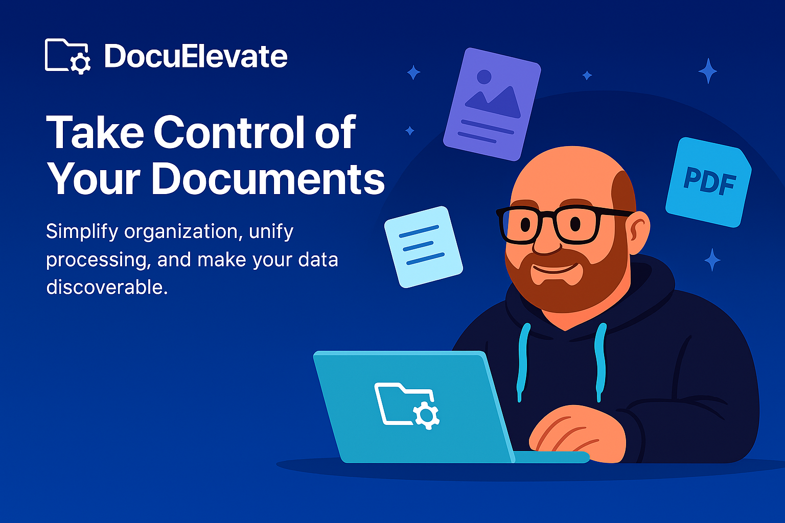
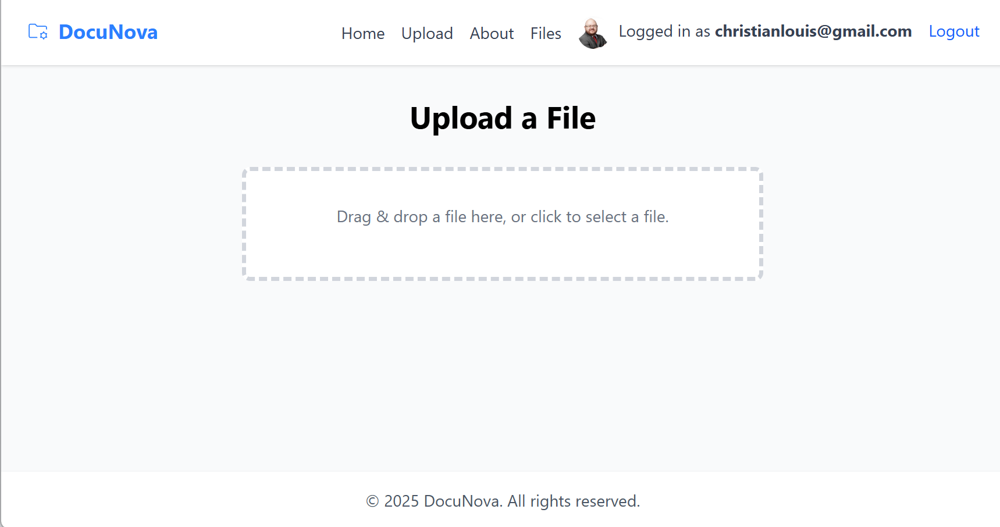
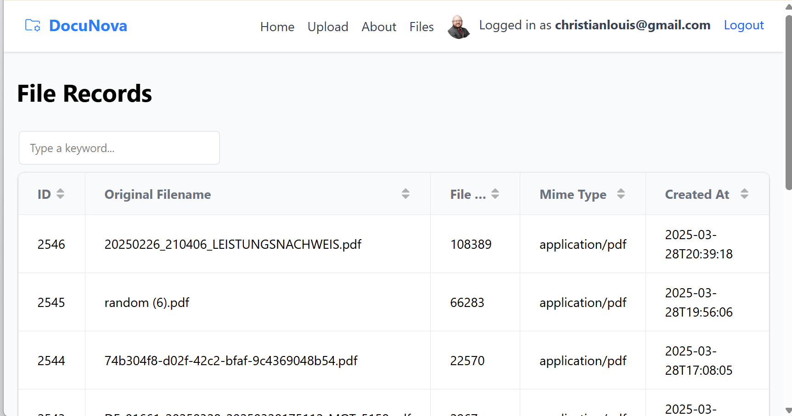
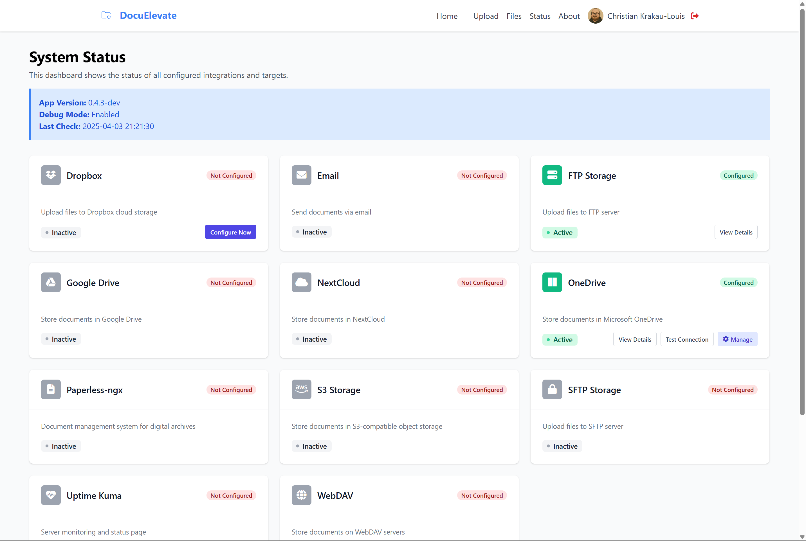
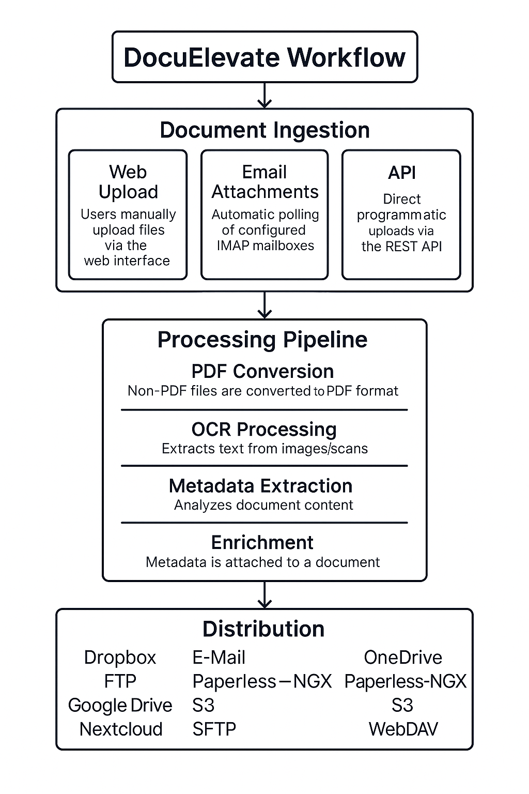

<div align="center">
  
  <p>Intelligent Document Processing & Management</p>
</div>

# DocuElevate

<div align="center">

[](https://codecov.io/github/christianlouis/DocuElevate)
[](https://github.com/christianlouis/DocuElevate/actions/workflows/ci.yml)
[](https://github.com/christianlouis/DocuElevate/actions/workflows/codeql.yml)

[](https://github.com/christianlouis/DocuElevate/releases)
[](LICENSE)
[](https://www.python.org/downloads/)
[](https://hub.docker.com/)

[](https://github.com/christianlouis/DocuElevate/stargazers)
[](https://github.com/christianlouis/DocuElevate/network/members)
[](https://github.com/christianlouis/DocuElevate/issues)
[](https://github.com/christianlouis/DocuElevate/pulls)

</div>

<div align="center">
  <a href="https://www.docuelevate.org"></a>
</div>

## Overview

DocuElevate is an intelligent document processing system that automates the ingestion, OCR, AI-powered metadata extraction, and distribution of documents. It supports a wide range of AI providers, OCR engines, and cloud storage destinations out of the box.

**Key capabilities:**

- **AI-Powered Metadata Extraction** — pluggable AI providers including OpenAI, Anthropic Claude, Google Gemini, Ollama (local), OpenRouter, Portkey, and Azure OpenAI via LiteLLM
- **Multi-Engine OCR** — Azure Document Intelligence, Tesseract, EasyOCR, Mistral OCR, Google Cloud Document AI, and AWS Textract with configurable merge strategies
- **12 Storage Destinations** — Dropbox, Google Drive, OneDrive, Amazon S3, Nextcloud, WebDAV, FTP, SFTP, iCloud Drive, Email (SMTP), Paperless-ngx, and Rclone
- **Multi-Channel Ingestion** — web upload, browser extension, mobile app, CLI, REST API, IMAP email, and watched folders (local, cloud, FTP/SFTP)
- **Processing Pipelines** — customizable multi-step workflows with conditional routing rules
- **Full-Text Search** — powered by Meilisearch for instant document discovery
- **Multi-User with SSO** — local accounts, OAuth2/OIDC (Authentik), and social login (Google, Microsoft, Apple, Dropbox)

The project ships with a web UI, a REST + GraphQL API, a CLI tool, a native mobile app (iOS & Android), a browser extension, and Helm charts for Kubernetes deployment.

## Screenshots

<div align="center">
  
  <p><em>Upload interface — drag-and-drop file upload with real-time progress</em></p>

  
  <p><em>Files view — processed documents with AI-extracted metadata</em></p>

  
  <p><em>Status view — system health and service monitoring</em></p>
</div>

> **Note:** Screenshots may not reflect the very latest UI. For the most current look, visit [docuelevate.org](https://www.docuelevate.org).

## Workflow

<div align="center">
  
</div>

### Ingestion

Documents enter DocuElevate through multiple channels:

| Channel | Description |
|---------|-------------|
| **Web Upload** | Drag-and-drop interface with real-time progress (up to 1 GB per file) |
| **Browser Extension** | Clip web pages or send files from Chrome, Firefox, or Edge |
| **Mobile App** | Capture documents with the device camera or upload from the photo library |
| **CLI** | Batch uploads and scripted workflows via the `docuelevate` command-line tool |
| **REST API** | Programmatic uploads with full API-token authentication |
| **Email (IMAP)** | Automatic polling of multiple mailboxes with attachment filtering |
| **Watched Folders** | Monitor local paths, FTP, SFTP, S3, Dropbox, Google Drive, OneDrive, Nextcloud, or WebDAV for new files |

### Processing Pipeline

Each document passes through a configurable set of steps:

1. **PDF Conversion** — Non-PDF files are converted using Gotenberg, with optional PDF/A archival conversion
2. **OCR** — Text extraction via one or more OCR engines (Azure, Tesseract, EasyOCR, Mistral, Google Document AI, AWS Textract) with configurable merge strategies
3. **AI Metadata Extraction** — The configured AI provider classifies the document and extracts structured metadata (type, dates, amounts, entities)
4. **Enrichment** — Metadata is embedded into the PDF and stored alongside the document
5. **Embedding Generation** — Vector embeddings for similarity search and duplicate detection

Steps can be customized using **Pipelines** and **Routing Rules** for conditional processing.

### Distribution

Processed documents are distributed to any combination of configured destinations:

| Destination | Type |
|------------|------|
| **Dropbox** | Cloud storage |
| **Google Drive** | Cloud storage |
| **OneDrive** | Cloud storage |
| **Amazon S3** | Object storage |
| **Nextcloud** | Self-hosted cloud |
| **WebDAV** | Protocol-based |
| **FTP / SFTP** | File transfer |
| **iCloud Drive** | Apple cloud |
| **Email (SMTP)** | Send as attachment |
| **Paperless-ngx** | Document management system |
| **Rclone** | 70+ cloud providers via Rclone |

## Features

### Document Processing
- **Multi-engine OCR** with quality checks and configurable merge strategies (AI merge, longest, primary)
- **AI metadata extraction** using any supported provider (OpenAI, Anthropic, Gemini, Ollama, OpenRouter, Portkey, Azure OpenAI)
- **PDF conversion** via Gotenberg with optional PDF/A archival format
- **Duplicate detection** — exact (SHA-256) and near-duplicate (content similarity with vector embeddings)
- **Customizable pipelines** — define multi-step processing workflows with conditional routing rules

### Document Management
- **Full-text search** powered by Meilisearch with saved searches
- **File detail view** with metadata, text preview, processing history, and similarity analysis
- **Shared links** for public document access with expiration controls
- **Bulk operations** — reprocess, delete, or reassign documents in batch

### Multi-Channel Ingestion
- **Web UI** — drag-and-drop upload with real-time progress
- **Browser extension** — clip web pages or send files from Chrome, Firefox, Edge ([guide](docs/BrowserExtension.md))
- **Mobile app** — iOS and Android with camera capture, push notifications, and SSO ([guide](docs/MobileApp.md))
- **CLI tool** — batch uploads, downloads, search, and API-token management ([guide](docs/CLIGuide.md))
- **REST API & GraphQL** — full programmatic access with Swagger documentation at `/docs`
- **IMAP email** — poll multiple mailboxes with attachment filtering and auto-processing
- **Watched folders** — local filesystem, FTP, SFTP, and cloud storage providers

### Administration
- **Multi-user mode** with per-user document isolation and ownership
- **Subscription & billing** — Stripe integration with configurable plans and quotas
- **Scheduled jobs** — IMAP polling, watched folder scans, automated backups, uptime monitoring
- **Audit logging** with SIEM integration support
- **Compliance templates** — GDPR, HIPAA, SOC 2
- **Admin dashboard** — user management, queue monitoring, credential management, backup/restore

### Authentication & Security
- **Local accounts** with self-service registration and password reset
- **OAuth2/OIDC** via Authentik or any OIDC provider
- **Social login** — Google, Microsoft, Apple, Dropbox
- **API tokens** for CLI, mobile, and automation access
- **Security headers** — HSTS, CSP, X-Frame-Options, X-Content-Type-Options
- **Rate limiting** with configurable per-endpoint controls

### Notifications
- **100+ notification backends** via Apprise — Discord, Telegram, Slack, Microsoft Teams, Email, webhooks, and more
- **Configurable events** — task failures, credential issues, file processed, user signup, payment issues
- **In-app notification inbox** with per-user preferences
- **Webhooks** — push events to external systems with HMAC signature verification and retry

## Tech Stack

| Component | Technology |
|-----------|-----------|
| **Backend** | FastAPI, Celery, Redis, SQLAlchemy, Alembic |
| **Frontend** | Jinja2, Tailwind CSS |
| **Search** | Meilisearch |
| **Mobile** | React Native (Expo) — iOS & Android |
| **AI** | LiteLLM (OpenAI, Anthropic, Gemini, Ollama, OpenRouter, Portkey) |
| **OCR** | Azure Document Intelligence, Tesseract, EasyOCR, Mistral, Google Doc AI, AWS Textract |
| **PDF** | Gotenberg, pypdf |
| **Auth** | Authlib (OAuth2/OIDC), MSAL, social providers |
| **Infrastructure** | Docker, Docker Compose, Helm/Kubernetes |
| **Docs** | MkDocs Material |

## Quick Start

For detailed installation and deployment instructions, see the [Deployment Guide](docs/DeploymentGuide.md).

```bash
# Clone the repository
git clone https://github.com/christianlouis/DocuElevate.git
cd DocuElevate

# Configure environment variables
cp .env.demo .env
# Edit .env with your settings (see Configuration Guide for all options)

# Run with Docker Compose
docker compose up -d
```

The web UI is available at **`http://localhost:8000`** and the interactive API documentation at **`http://localhost:8000/docs`**.

### Kubernetes / Helm

```bash
helm repo add docuelevate https://christianlouis.github.io/DocuElevate
helm install docuelevate docuelevate/docuelevate -f values.yaml
```

See the [Kubernetes Deployment Guide](docs/KubernetesDeployment.md) for full details.

## Documentation

### Getting Started

| Guide | Description |
|-------|-------------|
| [Setup Wizard](docs/SetupWizard.md) | Interactive first-run setup |
| [User Guide](docs/UserGuide.md) | How to use DocuElevate |
| [Browser Extension](docs/BrowserExtension.md) | Install and use the browser extension |
| [Mobile App](docs/MobileApp.md) | iOS and Android mobile app |
| [CLI Guide](docs/CLIGuide.md) | Command-line tool for automation |

### How-To Guides

| Guide | Description |
|-------|-------------|
| [How-To Overview](docs/HowToGuides.md) | Index of all how-to guides |
| [Email Ingestion](docs/howto/EmailIngestion.md) | Set up IMAP email polling |
| [Watched Folder](docs/howto/WatchedFolderSetup.md) | Monitor local or remote folders |
| [Mobile Scanning](docs/howto/MobileScanning.md) | Scan documents with your phone |

### Reference

| Guide | Description |
|-------|-------------|
| [API Documentation](docs/API.md) | REST & GraphQL API reference |
| [Configuration Guide](docs/ConfigurationGuide.md) | All environment variables |
| [Configuration Master](docs/ConfigurationMaster.md) | Configuration overview |
| [Settings Management](docs/SettingsManagement.md) | Runtime settings UI |

### Deployment & Operations

| Guide | Description |
|-------|-------------|
| [Deployment Guide](docs/DeploymentGuide.md) | Docker Compose deployment |
| [Kubernetes / Helm](docs/KubernetesDeployment.md) | Kubernetes deployment with Helm charts |
| [Production Readiness](docs/ProductionReadiness.md) | Checklist for production environments |
| [Database Configuration](docs/DatabaseConfiguration.md) | Database setup and migration |
| [Backup & Restore](docs/ConfigurationGuide.md#backup--restore) | Automated backup configuration |

### Storage Integration Setup

| Guide | Description |
|-------|-------------|
| [Dropbox](docs/DropboxSetup.md) | Dropbox OAuth setup |
| [Google Drive](docs/GoogleDriveSetup.md) | Google Drive service account / OAuth |
| [OneDrive](docs/OneDriveSetup.md) | Microsoft OneDrive setup |
| [Amazon S3](docs/AmazonS3Setup.md) | S3 bucket configuration |
| [Authentication](docs/AuthenticationSetup.md) | OAuth2, OIDC, and social login |
| [Notifications](docs/NotificationsSetup.md) | Notification backend setup |

### Security & Compliance

| Guide | Description |
|-------|-------------|
| [Credential Rotation](docs/CredentialRotationGuide.md) | Rotate secrets safely |
| [Licensing Compliance](docs/LicensingCompliance.md) | Dependency licenses |
| [Privacy & GDPR](docs/PrivacyCompliance.md) | Privacy compliance |

### Development

| Guide | Description |
|-------|-------------|
| [Contributing](CONTRIBUTING.md) | Code style, commits, and PR process |
| [Troubleshooting](docs/Troubleshooting.md) | Common issues and solutions |
| [Configuration Troubleshooting](docs/ConfigurationTroubleshooting.md) | Configuration-specific issues |
| [Build Metadata](docs/BuildMetadata.md) | Version and build information |
| [Internationalization](docs/InternationalizationGuide.md) | Translation and localization |

## Development & Testing

### Running Tests

```bash
# Install development dependencies
pip install -r requirements-dev.txt

# Run all tests
pytest

# Run with coverage report
pytest --cov=app --cov-report=term-missing

# Run only fast unit tests
pytest -m unit
```

Tests are automatically configured with the necessary environment variables — **no manual setup required!**

For detailed testing information, see the [Contributing Guide](CONTRIBUTING.md#running-tests).

### Contributing

We welcome contributions! Please see [CONTRIBUTING.md](CONTRIBUTING.md) for:
- Code style guidelines (Ruff for formatting and linting)
- Commit message format (Conventional Commits)
- Testing requirements
- Pull request process

## License

This project is licensed under the Apache License 2.0 — see the [LICENSE](LICENSE) file for details.

## Third-Party Software

This project uses various third-party libraries and components. See [NOTICE](NOTICE) for attributions and the [attribution page](frontend/templates/attribution.html) in the application for more details.

### LGPL Compliance

This project uses Paramiko which is licensed under LGPL-2.1. In accordance with the LGPL license:

- The source code for Paramiko can be obtained from https://github.com/paramiko/paramiko
- A copy of the LGPL license is available in the application at `/licenses/lgpl.txt`
- Users have the right to modify and redistribute Paramiko under the terms of the LGPL

## Dependency Licenses

The following is a summary of the licenses used by our direct dependencies:

| Dependency | License |
|------------|---------|
| FastAPI    | MIT     |
| Celery     | BSD     |
| Uvicorn    | BSD     |
| SQLAlchemy | MIT     |
| Pydantic   | MIT     |
| litellm    | MIT     |
| pypdf      | BSD     |
| Requests   | Apache 2.0 |
| Dropbox SDK | MIT    |
| Azure AI Document Intelligence | MIT |
| Authlib    | BSD     |
| Starlette  | BSD     |
| Alembic    | MIT     |
| Google API Client | Apache 2.0 |
| Microsoft Graph Core | MIT |
| MSAL       | MIT     |
| Boto3      | Apache 2.0 |
| Paramiko   | LGPL-2.1 |
| Apprise    | MIT     |
| Redis (py) | BSD     |
| Gotenberg Client | MIT |
| Meilisearch | MIT   |

For a comprehensive list of all dependencies and their licenses, run:

```bash
pip install pip-licenses
pip-licenses
```
