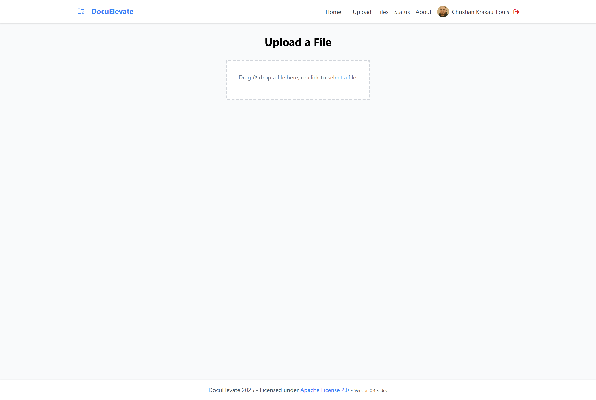

<div align="center">
  
  <h1>DocuNova</h1>
  <p>Intelligent Document Processing & Management</p>
</div>

## Overview

DocuNova automates the handling, extraction, and processing of documents using a variety of services, including:

- **OpenAI** for metadata extraction and text refinement.  
- **Dropbox** and **Nextcloud** for file storage and uploads.  
- **Paperless NGX** for document indexing and management.  
- **Azure Document Intelligence** for OCR on PDFs.  
- **Gotenberg** for file-to-PDF conversions.  
- **Authentik** for authentication and user management.  

It is designed for flexibility and configurability through environment variables, making it easily customizable for different workflows. The system can fetch documents from multiple IMAP mailboxes, process them (OCR, metadata extraction, PDF conversion), and store them in the desired destinations.

The project includes a **UI** for uploading and managing files, and an API documentation page is available at `/docs` (powered by **FastAPI**).

## Screenshots

<div align="center">
  
  <p><em>Upload interface for adding new documents</em></p>
  
  
  <p><em>Files view with processed documents and metadata</em></p>
</div>

## Workflow Process

DocuNova follows a streamlined document processing workflow:

<div align="center">
  
</div>

### Document Ingestion
Documents enter DocuNova through three possible channels:
1. **Web Upload**: Users manually upload files via the web interface
2. **Email Attachments**: Automatic polling of configured IMAP mailboxes (supports multiple accounts)
3. **API**: Direct programmatic uploads via the REST API

### Processing Pipeline
Every document goes through the following steps:
1. **PDF Conversion**: Non-PDF files are converted to PDF format using Gotenberg
2. **OCR Processing**: Azure Document Intelligence extracts text from images/scans
3. **Metadata Extraction**: OpenAI analyzes document content to identify:
   - Document type (invoice, receipt, contract, etc.)
   - Key entities (dates, names, amounts, account numbers)
   - Important data points specific to the document type
4. **Enrichment**: Metadata is attached to the document in a structured format

### Distribution
Processed documents with their metadata can be automatically sent to:
- **Dropbox**: For cloud storage and sharing
- **Nextcloud**: For self-hosted file storage
- **Paperless-NGX**: For advanced document management with search capabilities

Users can choose to send documents to any combination of these destinations through configuration settings or manual selection.

## Features

- **Document Upload & Storage**:  
  - Manual uploads (via API or UI) to Dropbox, Nextcloud, or Paperless.  
- **OCR Processing (Azure)**:  
  - Extract text from scanned PDFs using Azure Document Intelligence.  
- **Metadata Extraction (OpenAI)**:  
  - Use GPT to classify, label, or otherwise enrich the text with structured metadata.  
- **PDF Conversion (Gotenberg)**:  
  - Convert non-PDF attachments (e.g., Word docs, images) into PDFs.  
- **Document Management (Paperless NGX)**:  
  - Store processed documents and metadata in a Paperless NGX instance.  
- **IMAP Integration**:  
  - Fetch documents from multiple mailboxes (including Gmail) and automatically enqueue them for processing.  
- **Authentication**:  
  - Secure access to the system using **Authentik** for OAuth2-based login.  

## Frameworks Used

- **FastAPI**: A modern, fast (high-performance) web framework for building APIs with Python.  
- **Celery**: A distributed task queue for asynchronous processing.  
- **SQLAlchemy**: A powerful ORM for database interactions.  
- **Jinja2**: A templating engine for rendering HTML pages.  
- **Tailwind CSS**: A utility-first CSS framework for styling the UI.  

## Environment Variables

The `.env` file drives all configuration. This table breaks down key variables—some are optional, depending on which services you actually use.

### Core Settings

| **Variable**           | **Description**                                          | **Example**                    |
|------------------------|----------------------------------------------------------|--------------------------------|
| `DATABASE_URL`         | Path/URL to the SQLite database (or other SQL backend). | `sqlite:///./app/database.db`  |
| `REDIS_URL`            | URL for Redis, used by Celery for broker & result store. | `redis://redis:6379/0`         |
| `WORKDIR`              | Working directory for the application.                  | `/workdir`                     |
| `GOTENBERG_URL`        | Gotenberg PDF processing URL.                           | `http://gotenberg:3000`        |
| `EXTERNAL_HOSTNAME`    | The external hostname for the application.             | `docunova.example.com`         |

### IMAP Configuration (Multiple Mailboxes)

| **Variable**                  | **Description**                                              | **Example**       |
|-------------------------------|--------------------------------------------------------------|-------------------|
| `IMAP1_HOST`                  | Hostname for first IMAP server.                             | `mail.example.com`|
| `IMAP1_PORT`                  | Port number (usually `993`).                                | `993`             |
| `IMAP1_USERNAME`              | IMAP login (first mailbox).                                 | `user@example.com`|
| `IMAP1_PASSWORD`              | IMAP password (first mailbox).                              | `*******`         |
| `IMAP1_SSL`                   | Use SSL (`true`/`false`).                                   | `true`            |
| `IMAP1_POLL_INTERVAL_MINUTES` | Frequency in minutes to poll for new mail.                  | `5`               |
| `IMAP1_DELETE_AFTER_PROCESS`  | Delete emails after processing (`true`/`false`).            | `false`           |
| `IMAP2_HOST`                  | Hostname for second IMAP server (optional).                 | `imap.gmail.com`  |
| `IMAP2_PORT`                  | Port number for second mailbox.                             | `993`             |
| `IMAP2_USERNAME`              | IMAP login for second mailbox.                              | `you@gmail.com`   |
| `IMAP2_PASSWORD`              | IMAP password for second mailbox.                           | `*******`         |
| `IMAP2_SSL`                   | Use SSL for second mailbox (`true`/`false`).                | `true`            |
| `IMAP2_POLL_INTERVAL_MINUTES` | Frequency in minutes to poll second mailbox.                | `10`              |
| `IMAP2_DELETE_AFTER_PROCESS`  | Delete emails after processing (`true`/`false`) for mailbox.| `false`           |

### OpenAI & Azure Document Intelligence

| **Variable**          | **Description**                                                    | **How to Obtain**                                                                                              |
|-----------------------|--------------------------------------------------------------------|-----------------------------------------------------------------------------------------------------------------|
| `OPENAI_API_KEY`      | API key for OpenAI services (used for metadata extraction/refinement). | [OpenAI platform](https://platform.openai.com/account/api-keys)                                                |
| `OPENAI_BASE_URL`     | Base URL for OpenAI API (optional, defaults to OpenAI's endpoint). | `https://api.openai.com/v1`                                              |
| `OPENAI_MODEL`        | OpenAI model to use for tasks (e.g., GPT-4).                       | `gpt-4`                                                                                                        |
| `AZURE_AI_KEY`        | Azure Document Intelligence key (for OCR).                        | [Azure Portal](https://portal.azure.com/)                                                                        |
| `AZURE_REGION`        | Azure region of your Document Intelligence instance.              | e.g. `eastus`, `westeurope`                                                                                     |
| `AZURE_ENDPOINT`      | Endpoint URL for Document Intelligence.                           | e.g. `https://<yourendpoint>.cognitiveservices.azure.com/`                                                      |

### Authentik

| **Variable**            | **Description**                                               |
|-------------------------|---------------------------------------------------------------|
| `AUTH_ENABLED`          | Enable or disable authentication (`true`/`false`).           |
| `AUTHENTIK_CLIENT_ID`   | Client ID for Authentik OAuth2.                              |
| `AUTHENTIK_CLIENT_SECRET` | Client secret for Authentik OAuth2.                        |
| `AUTHENTIK_CONFIG_URL`  | Configuration URL for Authentik OpenID Connect.             |

### Paperless NGX

| **Variable**                  | **Description**                                     |
|-------------------------------|-----------------------------------------------------|
| `PAPERLESS_NGX_API_TOKEN`     | API token for Paperless NGX.                       |
| `PAPERLESS_HOST`              | Root URL for Paperless NGX (e.g. `https://paperless.example.com`). |

### Dropbox

| **Variable**            | **Description**                                  | **How to Obtain**                                                                 |
|-------------------------|--------------------------------------------------|------------------------------------------------------------------------------------|
| `DROPBOX_APP_KEY`       | Dropbox API app key.                             | [Dropbox Developer Console](https://www.dropbox.com/developers/apps/create)        |
| `DROPBOX_APP_SECRET`    | Dropbox API app secret.                          | [Dropbox Developer Console](https://www.dropbox.com/developers/apps/create)        |
| `DROPBOX_REFRESH_TOKEN` | OAuth2 refresh token for Dropbox.                | Follow Dropbox OAuth flow to retrieve                                              |
| `DROPBOX_FOLDER`        | Default folder path for Dropbox uploads.         | e.g. `"/Documents/Uploads"`                                                        |

### Nextcloud

| **Variable**            | **Description**                                               |
|-------------------------|---------------------------------------------------------------|
| `NEXTCLOUD_UPLOAD_URL`  | Nextcloud WebDAV URL (e.g. `https://nc.example.com/remote.php/dav/files/<USERNAME>`). |
| `NEXTCLOUD_USERNAME`    | Nextcloud login username.                                    |
| `NEXTCLOUD_PASSWORD`    | Nextcloud login password.                                    |
| `NEXTCLOUD_FOLDER`      | Destination folder in Nextcloud (e.g. `"/Documents/Uploads"`). |

## Running as a Docker Container

This project uses Celery (with Redis) for asynchronous task management and Gotenberg for PDF conversion. The `docker-compose.yml` file defines these services:

- **API Service**: Runs the FastAPI application via `uvicorn`.
- **Worker Service**: Runs the Celery worker for processing tasks (PDF conversions, OCR, etc.).
- **Redis**: Provides the message broker & result backend for Celery.
- **Gotenberg**: Offers PDF conversion capabilities.

### Running the Application with Docker Compose

1. **Install Docker and Docker Compose** on your system.  
2. **Clone the repository** and navigate into it:
   ```bash
   git clone <repository_url>
   cd <repository_name>
   ```
3. **Create and configure the `.env` file**:
   - Fill in the variables from the tables above.  
   - (At minimum, you need `DATABASE_URL`, `REDIS_URL`, `WORKDIR`, plus whichever service creds you plan to use.)
4. **Launch the services**:
   ```bash
   docker-compose up -d
   ```
5. The API will be available at **`http://localhost:8000`**, and the API documentation is available at **`http://localhost:8000/docs`**.

### Services in `docker-compose.yml`

Below is the default structure:

```yaml
services:
  api:
    image: christianlouis/document-processor:latest
    container_name: document_api
    working_dir: /workdir
    command: ["sh", "-c", "cd /app && uvicorn app.main:app --host 0.0.0.0 --port 8000 --proxy-headers"]
    environment:
      - PYTHONPATH=/app
    env_file:
      - .env
    ports:
      - "8000:8000"
    depends_on:
      - redis
      - worker
    volumes:
            - /var/docparse/workdir:/workdir

  worker:
    image: christianlouis/document-processor:latest
    container_name: document_worker
    working_dir: /workdir
    command: ["celery", "-A", "app.celery_worker", "worker", "-B", "--loglevel=info", "-Q", "document_processor,default,celery"]
    env_file:
      - .env
    environment:
      - PYTHONPATH=/app
    depends_on:
      - redis
      - gotenberg
    volumes:
            - /var/docparse/workdir:/workdir

  gotenberg:
    image: gotenberg/gotenberg:latest
    container_name: gotenberg

  redis:
    image: redis:alpine
    container_name: document_redis
    restart: always
```

## To-Do List

- **Make upload targets configurable** (e.g., easily choose only Dropbox, Nextcloud, or Paperless).  

---

**Questions or Issues?**  
- Feel free to open an issue or pull request.  
- For local testing or development, use `docker-compose up` and watch the logs via `docker-compose logs -f`.  
- Ensure your `.env` aligns with the environment variables listed above. If you see unexpected errors, check for typos or missing values.