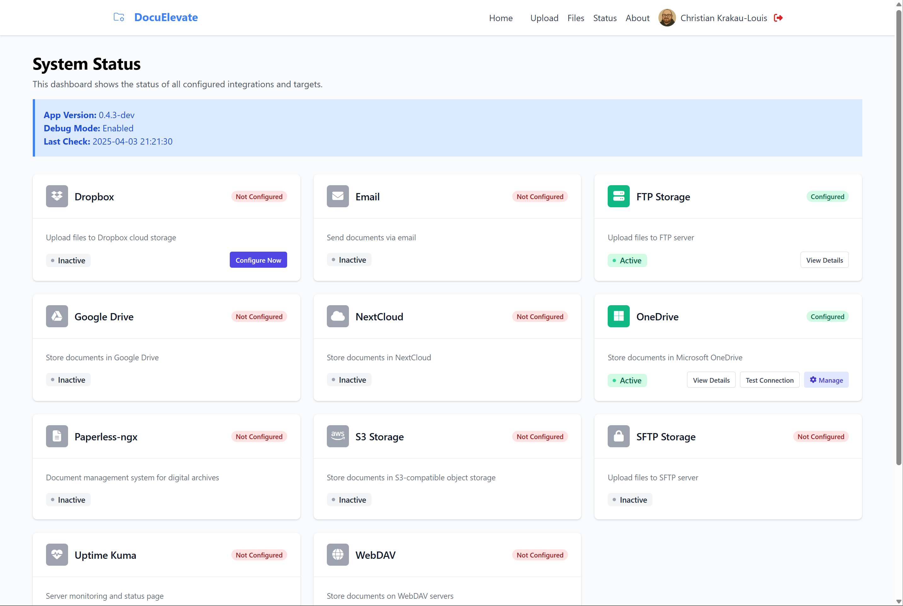

# DocuElevate Documentation

Welcome to the DocuElevate documentation. This directory contains comprehensive guides to help you install, configure, and use DocuElevate effectively.

## Available Documentation

### Getting Started
- [Setup Wizard Guide](SetupWizard.md) - First-run wizard walkthrough and initial configuration
- [User Guide](UserGuide.md) - How to use DocuElevate's features and interface

### Deployment
- [Deployment Guide](DeploymentGuide.md) - Docker Compose and Kubernetes/Helm deployment
- [Kubernetes Deployment Guide](KubernetesDeployment.md) - Detailed Kubernetes/Helm reference
- [Production Readiness Guide](ProductionReadiness.md) - Checklist to go from "it works" to production-hardened

### Configuration
- [Configuration Overview](ConfigurationMaster.md) - Overview of configuration options, including:
  - [Configuration Guide](ConfigurationGuide.md) - Complete list of all available configuration parameters
  - [Database Configuration](DatabaseConfiguration.md) - SQLite, PostgreSQL, migrations, and optimization
  - [Google Drive Setup](GoogleDriveSetup.md) - How to set up Google Drive integration
  - [Dropbox Setup](DropboxSetup.md) - How to set up Dropbox integration
  - [OneDrive Setup](OneDriveSetup.md) - How to set up Microsoft OneDrive/Graph integration
  - [Amazon S3 Setup](AmazonS3Setup.md) - How to set up Amazon S3 integration
  - [Authentication Setup](AuthenticationSetup.md) - How to set up user authentication
  - [Notifications Setup](NotificationsSetup.md) - How to set up system notifications

### Reference
- [API Documentation](API.md) - Complete API reference for developers
- [Configuration Troubleshooting](ConfigurationTroubleshooting.md) - Solutions to common configuration issues
- [Troubleshooting](Troubleshooting.md) - General troubleshooting and solutions to common issues
- [Licensing & Compliance](LicensingCompliance.md) - License information and third-party dependency compliance

## Additional Resources

- [Contributing Guide](../CONTRIBUTING.md) - How to contribute to DocuElevate development
- [License Information](../LICENSE) - Apache License 2.0 details

## Support

If you need additional assistance beyond what's covered in these guides:

1. Check the [GitHub repository](https://github.com/christianlouis/document-processor) for updates and issues
2. Contact the developer through the information provided on the About page

## Screenshots

*DocuElevate's upload interface*

*Document management interface*

*System management interface*

*DocuElevate processing workflow*
