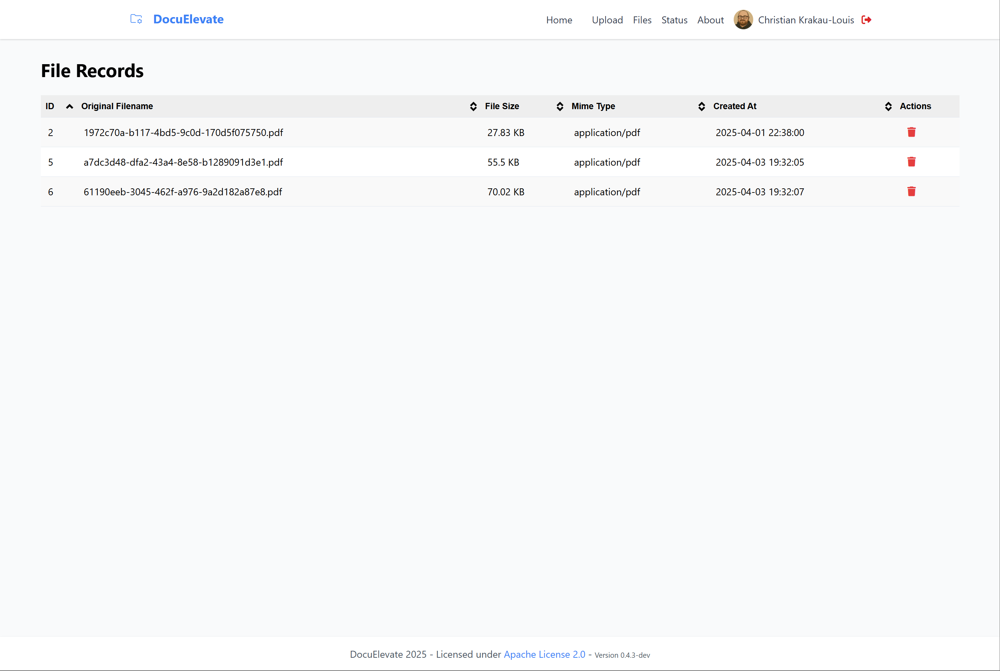

# DocuNova Documentation

Welcome to the DocuNova documentation. This directory contains comprehensive guides to help you install, configure, and use DocuNova effectively.

## Available Documentation

- [User Guide](UserGuide.md) - How to use DocuNova's features and interface
- [API Documentation](API.md) - Complete API reference for developers
- [Deployment Guide](DeploymentGuide.md) - How to deploy DocuNova in various environments
- [Configuration](ConfigurationMaster.md) - Overview of configuration options, including:
  - [Configuration Guide](ConfigurationGuide.md) - Complete list of all available configuration parameters
  - [Google Drive Setup](GoogleDriveSetup.md) - How to set up Google Drive integration
  - [Dropbox Setup](DropboxSetup.md) - How to set up Dropbox integration
  - [OneDrive Setup](OneDriveSetup.md) - How to set up Microsoft OneDrive/Graph integration
  - [Amazon S3 Setup](AmazonS3Setup.md) - How to set up Amazon S3 integration
- [Configuration Troubleshooting](ConfigurationTroubleshooting.md) - Solutions to common configuration issues
- [Troubleshooting](Troubleshooting.md) - General troubleshooting and solutions to common issues

## Additional Resources

- [Contributing Guide](../CONTRIBUTING.md) - How to contribute to DocuNova development
- [License Information](../LICENSE) - Apache License 2.0 details

## Support

If you need additional assistance beyond what's covered in these guides:

1. Check the [GitHub repository](https://github.com/christianlouis/document-processor) for updates and issues
2. Contact the developer through the information provided on the About page

## Screenshots

*DocuNova's upload interface*

*Document management interface*

*DocuNova processing workflow*
